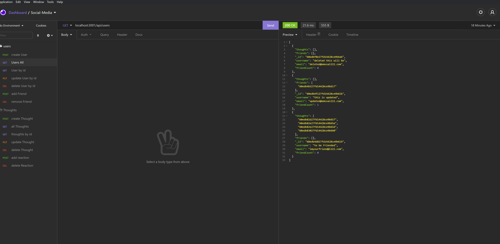

# Social Media

## Description

using server CRUD routes you are able to create a user, read the user info, update user info, delete user info, add friends, add thoughts, add reactions to those thoughts, remove reactions, delete thoughts and update thoughts as well.

## Table of Contents

- [Installation](#installation)
- [Contributing](#contributing)
- [Tests](#test)
- [Links](#links)
- [Questions](#questions)
- [License](#license)
- [Author](#author)

## Installation

clone repository, npm install, open terminal, and npm start then use insomnia if you don't have it installed already go ahead and instll it to see your routes.

## Contributing

Cody Hebert, anyone else who wants to contribute to this project feel free to do so.

## Tests

no testing needed

## Links

- walkthrough video https://youtu.be/BWtdTxfTOfc

- github https://github.com/CdHebert/social-media

## Questions

If you have any questions feel free to either email me the question:

- My email: Chebert222@gmail.com

## License

## Author

Cody Hebert

